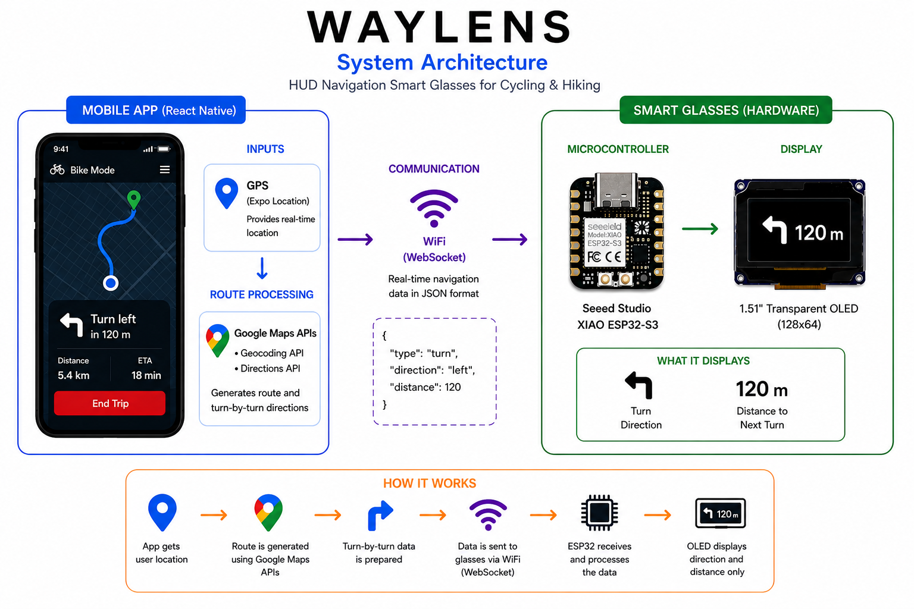

# WAYLENS

<p align="center">
  
</p>

WAYLENS is a HUD-based smart sunglasses system designed for cycling and hiking. It provides real-time navigation directly in the user’s field of view using a transparent OLED display embedded in the glasses, paired with a mobile app for GPS tracking and route guidance.

The goal of WAYLENS is to enable hands-free outdoor navigation without needing to check a phone.

---

## Project Overview

WAYLENS consists of two main components:

### Smart Glasses (Hardware)
- Powered by a **Seeed Studio XIAO ESP32-S3**
- Uses a **transparent OLED display** to project HUD information
- Connects to the mobile app via **WiFi (WebSockets)**
- Displays:
  - Turn directions (left, right, straight)
  - Distance to next turn
  - Basic navigation cues

### Mobile App (Frontend)
- Built with **React Native (Expo)**
- Handles:
  - GPS tracking
  - Route/navigation logic
  - Mode selection (Bike / Hike)
- Uses **Google Maps APIs** for:
  - Geocoding (address ↔ coordinates)
  - Directions / Routing (turn-by-turn data)
- Sends real-time navigation data to the ESP32

---

## Hardware Components

- **Seeed Studio XIAO ESP32-S3**
- **1.51" Transparent OLED Display (128×64, SPI)**
- **Sport Sunglasses Frame**
- **Battery (LiPo recommended for portability)**
- **Mounting materials**
  - Double-sided tape
  - Project Box

---

## Software & Technologies Used

### Embedded System
- **Language:** C/C++ (Arduino framework)
- **Libraries:**
  - U8g2 (OLED display)
  - WiFi (ESP32)
  - WebSocketsServer
  - ArduinoJson

### Mobile App
- **Framework:** React Native (Expo)
- **Language:** TypeScript / JavaScript
- **Libraries:**
  - Expo Location (GPS)
  - Expo Router / React Navigation
  - AsyncStorage
- **Google Maps Platform APIs**
  - Geocoding API
  - Directions API (routing)

---

## How It Works

1. The mobile app retrieves the user’s GPS location.
2. A destination is selected or searched.
3. Google Maps APIs generate route and navigation data.
4. Navigation instructions are formatted as JSON.
5. Data is sent over WiFi using a WebSocket connection.
6. The ESP32 receives the data.
7. The OLED display renders directions in real time on the glasses.

---

## Setup Instructions

### 1. Hardware Setup
- Connect OLED to ESP32 via SPI:
  - SCK, MOSI, CS, DC, RST pins
- Mount OLED onto sunglasses frame
- Secure ESP32 and battery

### 2. ESP32 Setup
- Install Arduino IDE
- Add ESP32 board support
- Install required libraries:
  - U8g2
  - WebSocketsServer
  - ArduinoJson
- Upload the firmware from the `/hardware` directory

### 3. Mobile App Setup
- Run on an Android device (recommended)
- Ensure phone and ESP32 are on the same WiFi network
```bash
cd app
npm install
npx expo start
```
### 4. API Configuration
- Create a Google Cloud project
- Enable:
  - Geocoding API
  - Directions API
- Add your API key to the app configuration

### 5. Connect System
- Ensure phone and ESP32 are on the same WiFi network
- Power on the ESP32
- Launch the mobile app
- The app connects via WebSocket
- Navigation data streams to the HUD